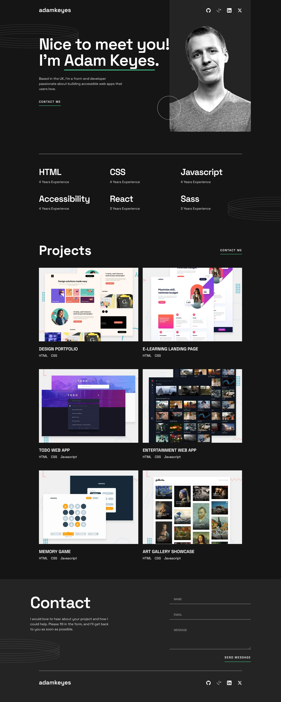

# Frontend Mentor - Single-page developer portfolio

# Frontend Mentor - Single-page developer portfolio solution

This is a solution to the [Single-page developer portfolio challenge on Frontend Mentor](https://www.frontendmentor.io/challenges/singlepage-developer-portfolio-bBVj2ZPi-x). Frontend Mentor challenges help you improve your coding skills by building realistic projects. 

## Table of contents

- [Overview](#overview)
  - [The challenge](#the-challenge)
  - [Screenshot](#screenshot)
  - [Links](#links)
- [My process](#my-process)
  - [Built with](#built-with)
- [Author](#author)

## Overview

### The challenge

Users should be able to:

- Receive an error message when the `form` is submitted if:
  - Any field is empty
  - The email address is not formatted correctly
- View the optimal layout for the interface depending on their device's screen size
- See hover and focus states for all interactive elements on the page

### Screenshot

### Links

- Solution URL: [Link](https://www.frontendmentor.io/solutions/single-page-developer-portfolio-built-w-angular-reactive-forms-sass-JwiMmzgsQ5)
- Live Site URL: [Link](https://single-page-developer-portfolio-ten.vercel.app/)

## My process

### Built with

- Angular
- Reactive Forms
- SASS
- SASS Mixins
- Mobile-first workflow

## Author

- Frontend Mentor - [@danielmrz-dev](https://www.frontendmentor.io/profile/danielmrz-dev)
- LinkedIn - [@danielmrz-dev](https://www.linkedin.com/in/danielmrz-dev/)
